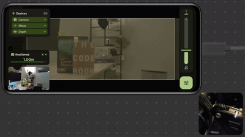

# Alice

**A**utofocus **L**ens **I**nterface for **C**inema **E**quipment

Alice is an Android app that turns your phone into an external autofocus controller for any camera. It uses the external depth information to measure distance and wirelessly controls a focus motor—no camera firmware integration required.

## When to Use Alice

Use Alice when your camera can’t provide reliable autofocus, or when autofocus isn’t available at all. Typical situations include:

* **Manual-focus lenses** with no built-in AF motor
* **Adapted lenses** that don’t communicate with the camera body
* **Linear polarizers** that interfere with phase-detect AF
* **Cameras with poor or restrictive firmware** that hampers autofocus performance
- ...

Alice doesn’t rely on your camera’s AF system. It measures distance with its own depth sensor and adjusts focus through a wireless motor, so it can work with virtually any lens once calibrated.

## Demo

🔗 https://youtu.be/VIDEO_ID

## Hardware Requirements

| Component | Requirement | Notes |
| :--- | :--- | :--- |
| **Phone / Tablet** | Android 8.0+ (API 26) | USB 3.0 recommended. |
| **Depth Camera** | [Intel RealSense](https://store.realsenseai.com/) | Any of: D415, D435, D435i, D435f, D455, D405.  *(Buy used to save money (╯°□°）╯︵ ┻━┻).* |
| **Focus Motor** | [Tilta Nucleus Nano II](https://tilta.com/shop/nucleus-nano-ii-wireless-lens-control-system) | Hand controller only needed for initial pairing. |
| **Wireless Bridge**| [nRF52840 USB Dongle](https://www.amazon.com/NRF52840-DONGLE-Micro-Dev-Kit-PCA10059/dp/B0F2J95GDR) | Required for wireless communication. |
| **Accessories** | USB Hub | To connect peripherals to the phone. |

## Features

**Manual Focus**
Direct motor control via on-screen slider. Full 0–4095 position range with preset buttons for common distances.

**Single Point Focus (AF-S)**
Tap anywhere on screen to focus at that point. Focus locks until you tap again—useful for static shots or recomposing after focus.

**Continuous Point Focus (AF-C)**
Tap to select a point, and Alice continuously tracks depth at that screen position. As the camera moves or subject distance changes, focus adjusts automatically.

**Face Tracking (AF-F)**
Automatic face detection and tracking. When multiple faces are present, tap to select which one to follow.

## Quick Start

1. Download the APK and `firmware.hex` from the [Releases](https://github.com/Stry233/Vanta/releases) page
2. Flash the firmware to your nRF52840 dongle
3. Install the APK on your phone
4. Connect your devices and calibrate your lens

For detailed setup, see [INSTRUCTION.md](INSTRUCTION.md).

## Building from Source

See [BUILD.md](BUILD.md).

## USB 2.0 Notes

USB 3.0 is recommended for full functionality. With USB 2.0 (480 Mbps), Alice automatically adapts by disabling the RGB stream from the RealSense and running depth-only mode. Autofocus still works, but you may experience lower frame rates.

## Limitations

A few things to keep in mind:

- **Depth accuracy varies.** Results depend on your sensor model, lighting conditions, and scene content. Reflective surfaces, glass, and extreme lighting can affect readings.

- **Calibration is required for each lens.** Alice needs to learn the relationship between measured distance and motor position for your specific lens. This takes a few minutes per lens.

- **Non-parfocal lenses require per-focal-length calibration.** If your lens shifts focus when zooming, you'll need separate calibration profiles for each focal length you use.

- **This is a supplementary tool.** For critical cinema work, a skilled AC is still your best option. Alice is designed to fill the gap for solo shooters and low-stakes scenarios.

## Acknowledgements

### Prior Work

The Tilta motor communication protocol was derived from [strawlab/tilta-n2-control](https://github.com/strawlab/tilta-n2-control), with modifications for Alice's requirements. Some firmware flashing instructions are adapted from their documentation. I appreciate their work in figuring out the protocol.

If you find code that should be attributed but isn't noted in the source, please open an issue.

### AI Assistance & Attribution

**Code:** Parts of the UI were generated with **Claude Sonnet 4.5**, subject to human review and verification.

**Media:** The assets in the video demo and repository banner are based on real photography, processed with **Nano Banana Pro** to optimize lighting and backgrounds.
