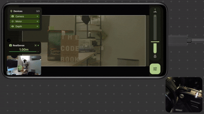

# Alice

**A**utofocus **L**ens **I**nterface for **C**inema **E**quipment

Alice turns any camera into an autofocus cinema rig. It pairs a depth sensor with a wireless focus motor to deliver tap-to-focus, continuous autofocus, and real-time face/eye tracking — no camera firmware integration required. Works with any manual or adapted lens.

<!-- PLACEHOLDER: res/hero-screenshot.png — side-by-side of Android app and Alice Studio
     showing a live face-tracking session with matching bounding boxes -->

## Demo

[Full video](https://www.bilibili.com/video/BV1Z3UDBoE55)

## Architecture

Alice is a three-component system:

<!-- PLACEHOLDER: res/architecture-diagram.png — block diagram showing:
     [Android App] <--WebSocket--> [Alice Studio (Desktop)]
                                        |
     [nRF52840 Dongle] <--802.15.4--> [Tilta Motor]
                                        |
     [Intel RealSense] --USB--> [Android / Desktop]
     [Capture Card] --HDMI/USB--> [Android / Desktop]  -->

| Component | Description |
|:----------|:------------|
| **Android App** | Mobile control surface. Runs face detection (ONNX YOLO + ML Kit), depth processing, and motor control over USB. Can operate standalone or pair with Alice Studio. |
| **Alice Studio** | Qt 6 desktop application for Linux and Windows. Full-featured monitoring station with live camera preview, depth overlay, autofocus pipeline, calibration tools, and system telemetry. |
| **Dongle Firmware** | Zephyr RTOS on nRF52840. Bridges USB CDC-ACM serial to IEEE 802.15.4 wireless to control the Tilta motor. |

When both apps are running, they pair over LAN via WebSocket. The desktop streams the camera feed and depth overlay to the phone, and both sides can control the motor and autofocus modes in real time.

## Features

### Autofocus Modes

| Mode | Shortcut | Description |
|:-----|:---------|:------------|
| **Manual (MF)** | `M` | Direct motor slider control. Full 0-4095 position range with 5 preset buttons. |
| **Single (AF-S)** | `S` | Tap to measure depth and focus once. Locks until next tap. |
| **Continuous (AF-C)** | `C` | Tracks depth at the selected point. Re-focuses automatically as the subject moves. |
| **Face Tracking (AF-F)** | `F` | YOLO-face detection with per-subject Kalman tracking, eye-priority focus, and hysteresis-based primary selection. Tap a face to pin it. |

### Alice Studio (Desktop)

<!-- PLACEHOLDER: res/studio-screenshot.png — Alice Studio in wide mode showing
     OPS view with camera feed, depth overlay, face tracking bounding boxes,
     motor slider, and system telemetry panel -->

- **OPS mode** — live camera feed (zoomable), depth preview with measurement reticle, motor position slider, face/eye tracking overlay, real-time histogram, system telemetry
- **CFG mode** — lens calibration with interactive graph, resolution and quality settings, LAN sync management, transmission quality sliders
- **Hardware identity** — status badges show real device names (from USB/RealSense descriptors), uptime, and per-device restart/disconnect/reconnect controls
- **GPU acceleration** — face detection runs on TensorRT, CUDA, or DirectML depending on the platform; CPU fallback runs at 60+ fps on desktop
- **Cross-platform sync** — QR-code pairing with the Android app over WebSocket; streams camera, depth, and face data bidirectionally with per-stream quality control

### Android App

<!-- PLACEHOLDER: res/android-screenshot.png — Android camera screen showing
     face tracking overlay and device status indicator -->

- Standalone operation with all four AF modes
- ONNX YOLO face detection with ML Kit eye landmark refinement
- Live depth overlay with draggable measurement point
- Motor discovery and address scanning
- Calibration recording and JSON export
- Sync with Alice Studio for remote monitoring

## Hardware Requirements

| Component | Requirement | Notes |
|:----------|:------------|:------|
| **Phone / Tablet** | Android 8.0+ (API 26) | USB 3.0 recommended for full RGB+depth streaming. |
| **Desktop** | Linux or Windows | Qt 6.5+, C++17 compiler. See [BUILD.md](BUILD.md). |
| **Depth Camera** | [Intel RealSense](https://store.realsenseai.com/) D415 / D435 / D455 / D405 | Any D4xx series. Used models work fine. |
| **Focus Motor** | [Tilta Nucleus Nano II](https://tilta.com/shop/nucleus-nano-ii-wireless-lens-control-system) | Hand controller needed only for initial pairing. |
| **Wireless Bridge** | [nRF52840 USB Dongle](https://www.amazon.com/NRF52840-DONGLE-Micro-Dev-Kit-PCA10059/dp/B0F2J95GDR) | Flashed with Alice firmware. |
| **Accessories** | USB hub | To connect peripherals to the phone or desktop. |
| **Capture Card** *(optional)* | Any UVC-class HDMI capture card | For monitoring the camera's HDMI output on Alice Studio. |

## Quick Start

1. **Flash the dongle** — download `firmware.hex` from [Releases](https://github.com/Stry233/Vanta/releases) and flash via nRF Connect Programmer
2. **Pair the motor** — use the Tilta hand controller to pair on channel 12, then turn the controller off
3. **Install the app** — install `alice.apk` on your phone, or build Alice Studio from source
4. **Connect hardware** — plug the dongle, RealSense, and (optionally) a capture card into a USB hub
5. **Calibrate your lens** — record 3-5 depth/motor points across your focus range, then export
6. **Shoot** — select AF-S, AF-C, or AF-F and let Alice handle focus

## Documentation

| Guide | Description |
|:------|:------------|
| [Getting Started](docs/getting-started.md) | Hardware setup, firmware flashing, first connection |
| [Android Guide](docs/android-guide.md) | Android app features and daily usage |
| [Alice Studio Guide](docs/desktop-guide.md) | Desktop app features, keyboard shortcuts, layout modes |
| [Sync Setup](docs/sync-guide.md) | Pairing Android and Desktop over LAN |
| [Calibration](docs/calibration.md) | In-depth calibration workflow and best practices |
| [Troubleshooting](docs/troubleshooting.md) | Common issues and solutions |
| [Building from Source](BUILD.md) | Compile instructions for Android, Desktop, and Firmware |

## USB 2.0 Notes

USB 3.0 is recommended. On USB 2.0 (480 Mbps), Alice disables the RGB stream and runs depth-only mode. Autofocus still works, but frame rates may be lower.

## Limitations

- **Depth accuracy varies** with sensor model, lighting, and scene content. Reflective surfaces and extreme lighting degrade readings.
- **Per-lens calibration required.** Each lens needs its own depth-to-motor mapping. Non-parfocal lenses need separate profiles per focal length.
- **Supplementary tool.** For critical cinema work, a skilled AC is still your best option. Alice is designed for solo shooters and low-stakes scenarios.

## Acknowledgements

### Prior Work

The Tilta motor communication protocol was derived from [strawlab/tilta-n2-control](https://github.com/strawlab/tilta-n2-control), with modifications for Alice's requirements. Some firmware flashing instructions are adapted from their documentation.

If you find code that should be attributed but isn't noted in the source, please open an issue.

### AI Assistance

Parts of the codebase were developed with assistance from **Claude** (Anthropic). All AI-generated code was reviewed and verified by the maintainer. Individual commits note the model used in the `Co-Authored-By` trailer.

## License

[MIT](LICENSE)
